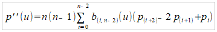

# Bezier Curve

## Overview
### Basic Specification
The assignment of the practical is to implement an application to display Bezier Curve of any degree by 
specifying its controlling points on a drawing area. The application should be able to sample the curve 
uniformly by the arc length, highlight the sampling points and display tangent and curvature vectors if 
specified.

### Advanced Specification
As advanced specification, the controlling points can be dragged by mouse and the curve dynamically 
changes its shape.

## Running
The jar file is in `out/artifacts/` folder and can be run by this command:
`java -jar CS4102Practical1.jar`

## Design and Implementation
### Basic Specification
#### Application Logic
The application logic is split into 3 classes:
- `MainApp`
- `CurveDraw`
- `BezierCurve`

The `MainApp` class deals with the GUI layout and accepting the user input. This includes pressing the 
buttons, checking the check boxes and the text field for number of sample points. `BezierCurve` implements 
the logic behind the Bezier Curves, that is storing the controlling points, getting points, tangent 
vectors and curvature vectors on the curve based on a given parameter. This class also contains a method 
to produce a specified number of points on  the curve that are sampled uniformly based on the curve 
length. The class that links `MainApp` and `BezierCurve` is `CurveDraw`. It has a field for `Graphics2D` object 
from `MainApp` and a `BezierCurve` object. The results provided by the `BezierCurve` methods are used to draw 
the curve and sampled points on the application screen by invoking methods of passed `Graphics2D` object. 
Additionally, a class called `Vector` to store and perform basic mathematical operations on vectors is 
implemented.

#### Bezier Curve
Each point on a Bezier curve can be parametrically obtained by this formula:  
  
where u represents the parameter, n is the number of controlling points and pi is an ith controlling 
point vector. All the points on a Bezier curve can be defined by the parameter u that is between 0 and 1. 
By this formula p(0) returns the first controllig point and p(1) returns the last controlling point. 
To draw the curve, the GeneralPath object from java.awt.geom library is used. The curve is drawn as a 
large number of small lines that start and lead to a point on the curve obtained by the formula. We 
simply need to choose a number small enough to increment the u parameter by and iterate it from 0 to 1. 
In our case, step size of 0.01 seems to produce smooth enough curves.  

Bezier curves are not sampled uniformly by the parameter, meaning same parameter distances of any 2 
points on the curve may not produce the same arc distances. Bezier curves oversample in turns. Therefore, 
we cannot produce uniformly sampled points on the curve by simply incrementing the parameter. To do 
that, we first need to know the overall length of the curve. The length can be obtained the same way we 
draw the curve, by incrementing the parameter with a small enough number, creating lines between the 
created points, and then summing up the distances of all the small lines. When we get the points on the 
curve, we store the arc distances of the points from the start in HashMap, with according parameters to 
those distances mapped as values. Once we’ve calculated the overall length, we can divide it by the number 
of uniform points we want to display and calculate distances for each from the start. Now, using the binary 
search, we’ll look through the HashMap distances, find the closest larger distance to each sample point 
that we have stored and assign its parameter to the sample point. Given a desired number of sample points 
and a number of all points in the HashMap, the overall complexity of finding the sample points is:  
  
It should also be said, that the curve is sampled such, that the first and the last sample points are at 
the start and the end of the curve respectively.  
  

To acquire the tangent vector of a sample point specified by a parameter, we need to get the first 
derivative of the Bezier curve formula with respect to the parameter:  
  
where bi,n-1(t) is a set of polynomials called Bernstein basis polynomials that are equal to:  
  
The whole formula is implemented in the method called getTangent() that takes the parameter t as argument 
and produces the first derivative which is the tangent vector for a sample point on the curve specified 
by the parameter.

The second derivative, which is the curvature vector, is normally perpendicular to the tangent vector, 
however, since all the points on Bezier curve are not sampled uniformly this doesn’t hold here, and we 
need to implement a different method of getting the curvature vector. To proof this, a Bezier curve of 
quadratic and cubic degree is provided with curvature vector at sample points.

The images prove that the second derivatives of the quadratic curve do not even depend on the parameter 
and are constant. To understand this, we need to look at the formula for the second derivative:  
  
where Bn-2,i are the Bernstein basis polynomials. When we assign 3 to n, we get the formula for the 
quadratic Bezier curve:  
  
We can see that the parameter does not even appear in the formula, because the second derivation gets rid 
of it. The curvature vector in the quadratic Bezier curve therefore purely depends on the position of the 
controlling points.  

Given these facts, we know the curvature perpendicular to the tangent vector is not 
equal to the second derivative. The second derivative is still useful though, because it points in the 
general direction of the curvature vector, that is either left or right of the tangent vector and therefore 
it is implemented as the `getSecondDeriv()` method. To obtain the angle, we use the function atan2 and pass 
cross product and dot product of the first and second derivatives as arguments. This formula, will not only 
give us angle, but most importantly, the sign of the angle. When we know the sign, we know the side the 
curvature vector should point to. To find a vector perpendicular to the tangent vector, we simply switch 
the x and y coordinates in the tangent vector and revert the sign for one of them. Which sign to revert, 
depends on which side of the tangent vector should the curvature vector point to. The described logic is 
implemented in the `getCurvature()` method which calls the methods `getTangent()` and `getSecondDeriv()` to 
acquire the first and the second derivative vectors and then finds the curvature vector based on them.  

The lengths of tangent and curvature vectors are equal to the length of the first and the second 
derivatives scaled by a constant factor called `SIZE_MULTIPLIER` to fit into the screen.
  
  

### Advanced Specification
The whole logic of the point dragging is implemented inside the `CurveDraw` class. To allow for this 
behaviour, the `MainApp` class needs to implement `MouseListener` and `MouseMotionListener` interfaces 
which are passed the `MouseEvent` objects required for the input recognition. The CurveDraw class 
implements handlers to deal with mouse being pressed, clicked, dragged and released which are then 
invoked in the `MainApp` class. The curve is simply repainted all the time while a point is dragged and 
stops being repainted when it is released.

## Testing
The testing is provided in the form of JUnit tests that test the `Vector` and `BezierCurve` classes 
extensively. Since the other classes output onto the screen, testing them would require a much more 
difficult approach I did not have time to implement.

## Conclusion
I’ve implemented the basic specification, including choosing the controlling points, sampling the 
curve uniformly and displaying the tangent and curvature vectors at the sampling points. The user 
can choose an arbitrary number of sampling points and switch on and off the displaying of the vectors. 
I’ve implemented a modular solution that splits the program logic into 3 parts, and any of the 3 parts 
can be swapped provided that the new class will implement the required methods. I’ve explained the logic 
behind tangent and curvature vectors and provided according graphical and mathematical proofs. 
Additionally, the user can choose to display the second derivative vector to compare with the curvature 
and can drag the controlling points for a dynamic change of the curve. The BezierCurve and Vector class 
are properly tested by JUnit tests. The most difficult part of the practical was to find the proper 
curvature vector and deal with the non-uniform distribution of the curve. Given more time, I’d rewrite 
the application in Processing and provided the curve in 3D.